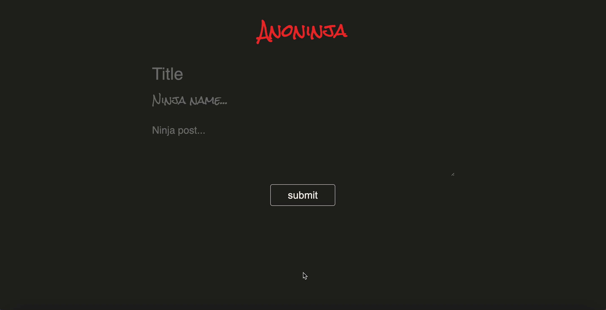

# Anoninja :octocat:

Inspired by [Telegraph](https://telegra.ph/), this app allows <del>users</del> ninjas to write down their thoughts whilst remaining anonymous.

Posts are stored in a MongoDB database and can be accessed through an API. This app was created by [@cwesterduin](https://github.com/cwesterduin) and [@roselynle](https://github.com/roselynle) as part of Futureproof's Coding Challenge.

### Installation

-   Clone or download this repo 

### Usage

-   Open your terminal/CLI and navigate to the `anoninja` folder
-   Ensure docker desktop app is running
-   Run `docker-compose up` to start the API and DB services
    -   Access: client on localhost:8080/ and server on localhost:3000/     
-   Run `docker-compose down` to stop the services and keep data
-   Run `docker-compose --volumes --remove-orphans` to stop the services and remove all artifacts

## Technologies

-   HTML, CSS and JavaScript
    -   Dependencies include: express, cors, nodemon, mongoDB, watchify, concurrently
-   Test suite: Jest

## Process

-   Split the team into into two with one person focusing on client side and the other on server side
-   Looked at the design/layout of [Telegraph](https://telegra.ph/) for inspiration on the user interface
-   Made use of the GitHub project board to keep on top of required tasks 
-   Set up the database using MongoDB
-   Implemented the required functionalities, and debugged any issues
-   Added styling

## Task Requirements

-   [x] The app should have a browser client allowing users to write a post with a title, a pseudonym and a body
-   [x] No login should be required to create a post or visit a post
-   [x] When a user hits 'publish', the post should be stored in a database and the client redirected to a show path
-   [x] The user should be able to access their post using that show path even after a server restart
-   [x] Edit and delete functionality is not required

## Wins & Challenges

### Wins

-   Achieved a minimum viable product that met the task requirements - user is able to create a post and be redirected to their new post
-   Connected API to database, and improved our knowledge and understanding of MongoDB
-   Managed to containerise our app using Docker
-   Successfully connected server to client
-   Good git flow - appropriate division of tasks and no issues with conflicts 

### Challenges

-   Not having enough time to perform (optional) unit/integration. However these can be done at a later date.
-   Not knowing how to send the id from the server back to the client to redirect users to their new post. This was later solved by checking the MongoDB documentation
-   Getting errors for sending new posts - this was due to errors in the create post function in the model 

## Bugs

-   Should display an error if no post is found from the url
